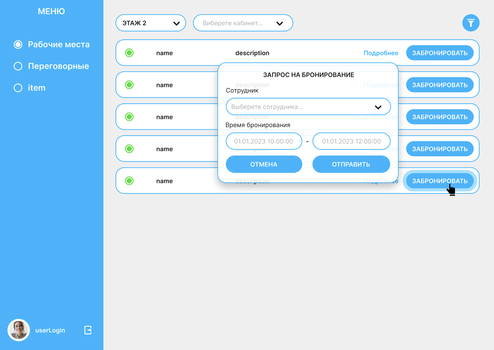
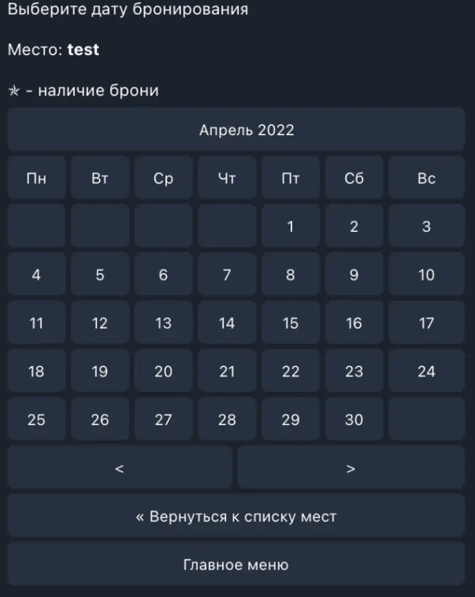
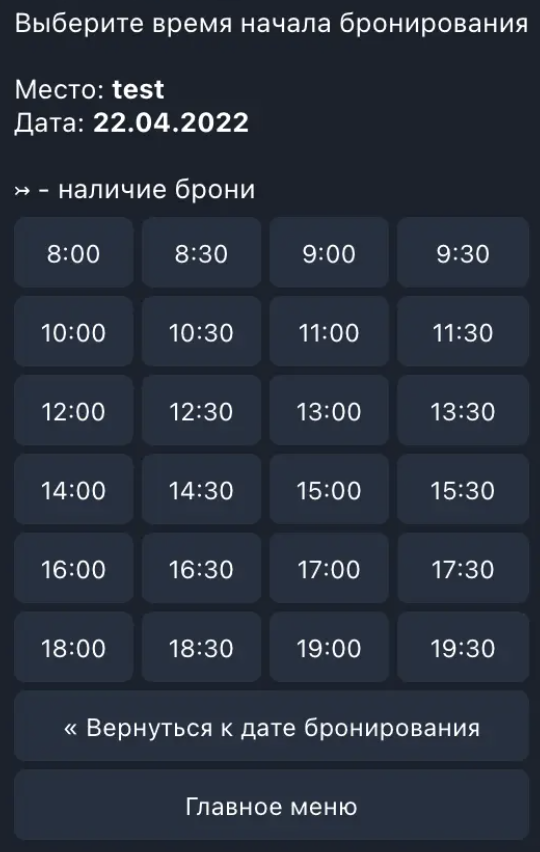

OSMS - это инструмент для брониромвания рабочих мест и переговорных и организации эффективной гибридной работы сотрудников с интеграцией с Telegram Bot.

## Визуальная схема фронтенда

## Документация

1. Маркетинг
    1. [Стейкхолдеры](./docs/01-marketing/01-stakeholders.md)
    2. [Целевая аудитория](./docs/01-marketing/02-target-audience.md)
    3. [Конкурентный анализ](./docs/01-marketing/03-concurrency.md)
    4. [Анализ экономики](./docs/01-marketing/04-economy.md)
    5. [Пользовательские истории](./docs/01-marketing/05-user-stories.md)
2. DevOps
    1. [Схема инфраструктуры](./docs/02-devops/01-infrastruture.md)
    2. [Схема мониторинга](./docs/02-devops/02-monitoring.md)
3. Тесты
4. Архитектура
   1. [Архитектурная диаграмма](./docs/04-architecture/01-arch.md)
   2. [Схема интеграции](./docs/04-architecture/02-integration.md)
   3. [API](./docs/04-architecture/03-api.md)