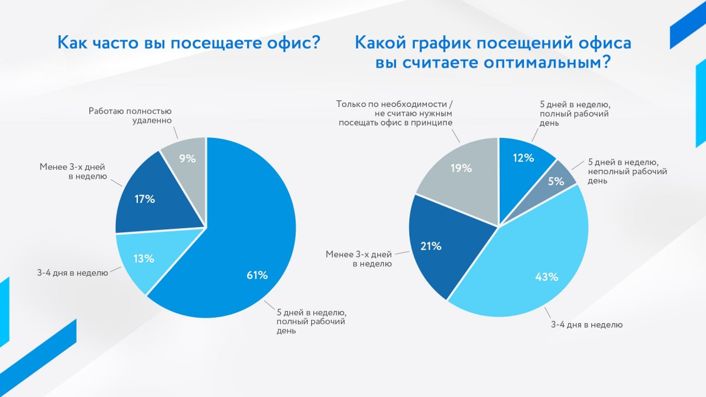
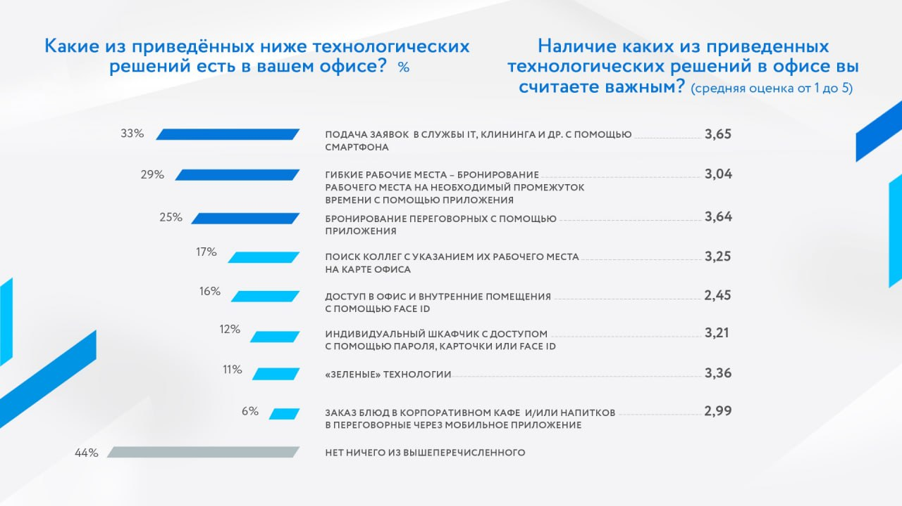
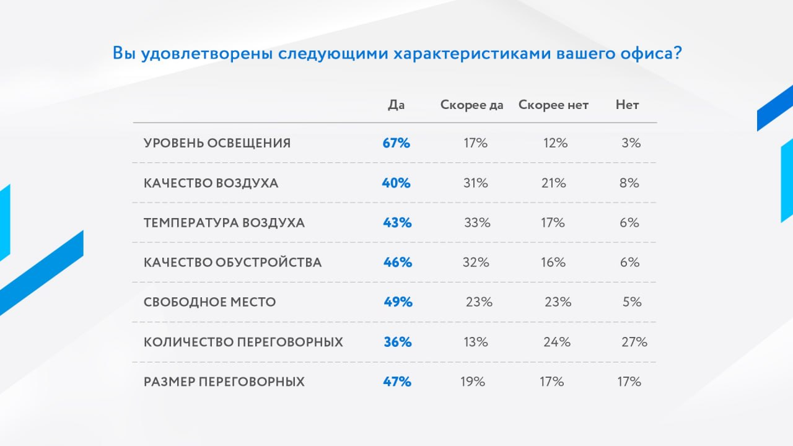

# Экономический анализ

## Объем рынка в целом

Ожидается, что на мировом рынке интегрированных систем управления рабочими местами среднегодовой темп роста составит 13.4% в течение прогнозируемого периода (2021–2026 гг.). Потребность в оптимизации операций, а также в объединении людей и процессов приводит к росту рынка.

Источник: https://www.mordorintelligence.com/ru/industry-reports/integrated-workplace-management-system-market

### Объем российского рынка офисного программного обеспечения (ПО)

Объем российского рынка офисного программного обеспечения (ПО) к 2027 г. может составить 85,2 млрд руб., при этом доля отечественных разработчиков увеличится с нынешних 12% до 82%, говорится в исследовании компании J’son & Partners Consulting.
Согласно результатам текущего исследования, при сохранении наблюдаемых тенденций можно ожидать, что к концу 2027 г. большую долю рынка (82%) будут занимать российские платформы офисного ПО, на долю opensource-решений придется 10%, а на долю зарубежных – 8%. В 2021 г. эти показатели были на уровне 12, 18 и 70% соответственно.
Объем российского рынка офисного ПО уже вырос с 38,8 млрд руб. в 2020 г. до 42,5 млрд руб. в 2021 г. Основная доля рынка пришлась на коммерческий сектор – 28,8 млрд руб. На 2-м месте – государственный сектор (10,9 млрд руб.), на третьем – физические лица (2,8 млрд руб.). Для сравнения: в 2020 г. коммерческие компании потратили на офисный софт 26,2 млрд руб., госкомпании – 9,9 млрд руб., физические лица – 2,7 млрд руб.
В 2027 г. объем рынка может достичь 85,2 млрд руб., а его потенциальная емкость (с учетом пользователей необновляемого, устаревшего и нелицензионного ПО) – 327,3 млрд руб., подсчитали в J’son & Partners Consulting.

Источник: https://www.vedomosti.ru/realty/articles/2022/08/15/936137-dolya-rossiiskogo-ofisnogo-virasti

### Рынок умных зданий

Согласно последним исследованиям [Fortune Business Insights](https://www.fortunebusinessinsights.com/industry-reports/smart-building-market-101198), объём мирового рынка интеллектуальных зданий в 2020 году составил 57,3 млрд долларов и будет расти в среднем на 21,6% в год — до внушительных 265 млрд долларов к 2028 году.
Россия не в числе лидеров по количеству зданий, которые можно назвать интеллектуальными, но всё же COVID-19 и ESG стимулируют интерес к данной концепции, и российские компании продолжают инвестировать в рынок интеллектуальных зданий.

Источник: https://sber.pro/publication/ochen-umnye-zdaniia-zachem-eto-biznesu/

### Рынок гипких офисов в Москве

Рынок гибких офисных пространств Москвы вырос на 25% по сравнению с показателем конца 2021 года, следует из отчета, который подготовили аналитики CMWP. В 2020-21 гг. в среднем ежегодно открывалось 60-65 тыс. кв. м гибких рабочих пространств. Несмотря на то, что в 2022 году деловая активность более сдержанная, чем в предыдущие периоды, показатель уже достиг 81 тыс. кв. м, а по итогам года может превысить 100 тыс. кв. м.
Подобная динамика связана с тем, что около 50 тыс. кв. м нового ввода представлено двумя площадками, которые были открыты после заключения OZON крупных сделок аренды в 2021 году.
Доля гибких рабочих пространств в общем объеме офисных площадей Москвы стабильно увеличивается последние пять лет. Тренд сохранился и в турбулентном 2022 году. На сегодняшний день, в Москве функционирует 154 форматных гибких рабочих пространства, 113 из них сетевые. Самые популярные районы размещения: Центральный, Ленинградский Коридор и Москва-Сити.

Источник: https://cre.ru/analytics/88115

### Гибридный график работы

Согласно результатам проведенного Ассоциацией менеджеров и Pridex опроса, 30% офисных сотрудников уже работают из офиса менее пяти дней в неделю, ещё 9% - полностью удалённо.
При этом 64% опрошенных назвали гибридный график наиболее предпочтительным.

**Рабочий график**

**Технические характеристики офиса**

Наиболее уязвимым местом стали переговорные: более половины опрошенных отметили, что их количество в офисах недостаточно, 34% также выразили неудовлетворённость размером переговорных.

Самыми распространенными решениями в офисах у опрошенных сотрудников оказались различные сервисы «управления» с помощью смартфона: например, подача заявок в службы ИТ и клининга (33%), «гибкие рабочие места» (бронирование рабочего места на необходимый промежуток с помощью смартфона) – 29%, а также бронирование переговорных через мобильное приложение – 25%.
При этом подача заявок и бронирование переговорных также стали и наиболее востребованными.

Источник: https://cre.ru/analytics/92069

### Инвестиции в системы по созданию гибкого офиса

18 мая 2022 года стало известно об инвестировании 6 млн рублей в [IndaSpace](https://indaspace.io/product). В стартап вложился основатель [«Нетологии-групп»](https://www.tadviser.ru/index.php/%D0%9A%D0%BE%D0%BC%D0%BF%D0%B0%D0%BD%D0%B8%D1%8F:%D0%9D%D0%B5%D1%82%D0%BE%D0%BB%D0%BE%D0%B3%D0%B8%D1%8F) и Digital Dolina [Максим Спиридонов](https://www.tadviser.ru/index.php/%D0%9F%D0%B5%D1%80%D1%81%D0%BE%D0%BD%D0%B0:%D0%A1%D0%BF%D0%B8%D1%80%D0%B8%D0%B4%D0%BE%D0%BD%D0%BE%D0%B2_%D0%9C%D0%B0%D0%BA%D1%81%D0%B8%D0%BC_%D0%AE%D1%80%D1%8C%D0%B5%D0%B2%D0%B8%D1%87).
Полученные средства сервис для поиска переговорных и рабочих мест потратить на ускорение роста бизнеса в России и выход на зарубежные рынки, а также на маркетинг и развитие продукта.
Прежде компания развивалась за счет средств основателей.

Источник: https://www.tadviser.ru/index.php/%D0%9A%D0%BE%D0%BC%D0%BF%D0%B0%D0%BD%D0%B8%D1%8F:Indaspace_%28%D0%A1%D0%BF%D0%B5%D0%B9%D1%81_%D0%A1%D0%BE%D1%84%D1%82%29

### Итог

Приблизительно ожидаемый объем рынка 1,14 млрд. рублей.
Потенциально достижимая доля рынка стартапа составит 15%
Потенциальный ежегодный оборот составит примерно 171 млн. руб.
Потенциально достижимый доход составит примерно 5,6 млн. руб. в год